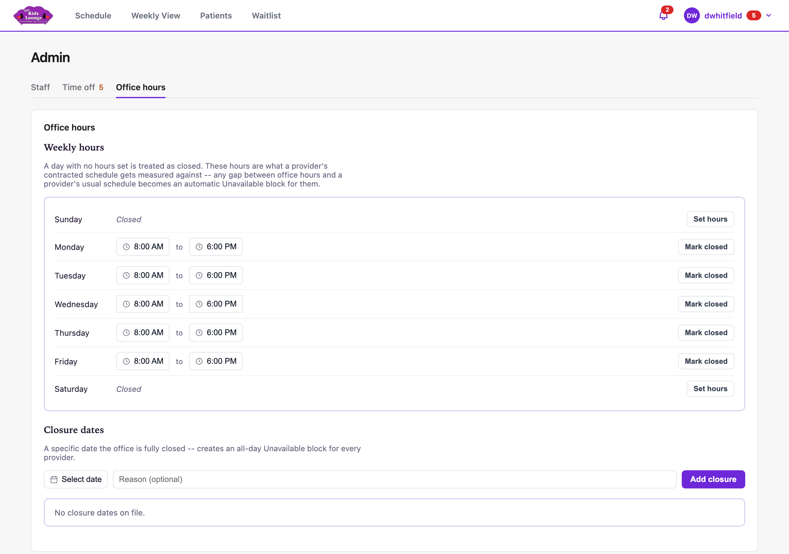

## Office hours and closures

The **Office hours** tab in Admin sets when the clinic is open.

- **Weekly hours:** set the opening and closing time for each day. **Mark closed** closes a day, and **Set hours** opens it again. Any gap between office hours and a provider's contracted hours shows as unavailable time for them.
- **Closure dates:** for a holiday or other day the office is shut, pick the date, add a reason, and click **Add closure**. Every provider gets an all-day block, and appointments booked that day show as conflicts.
