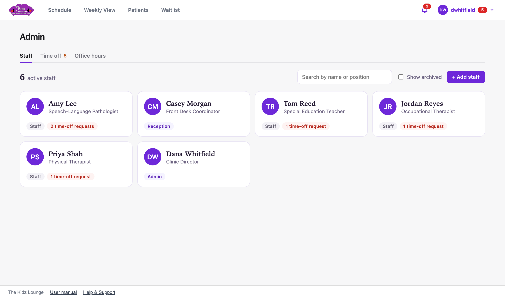
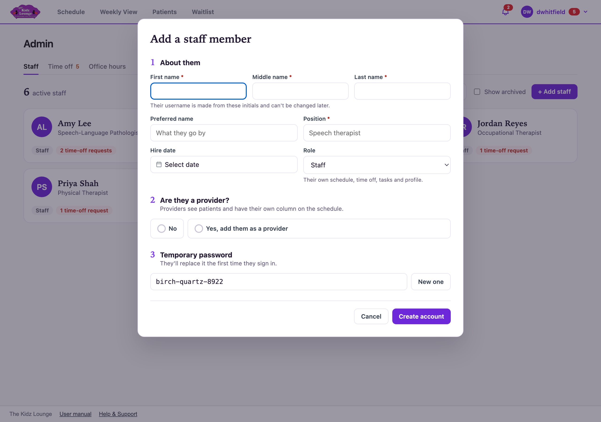
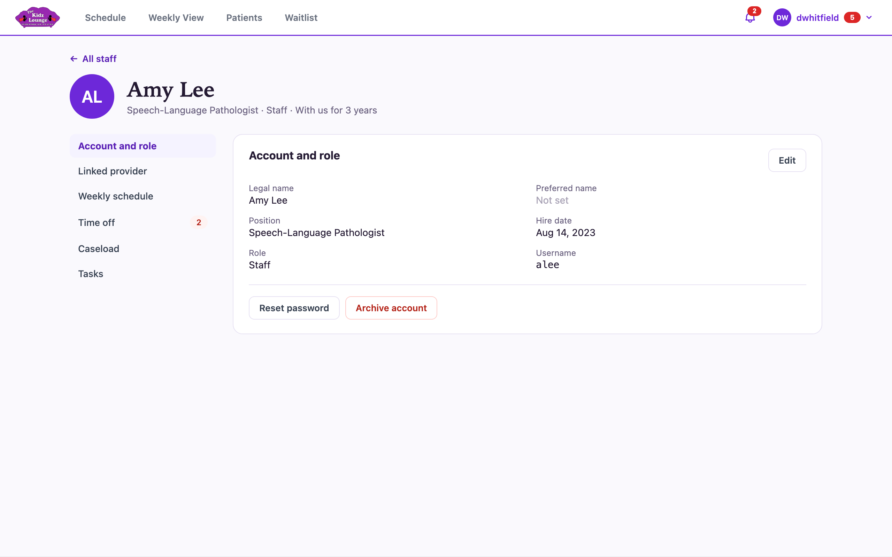
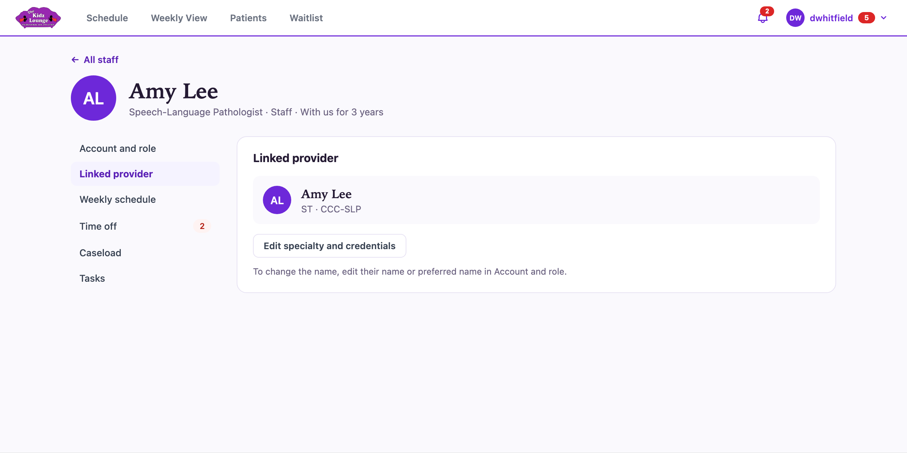
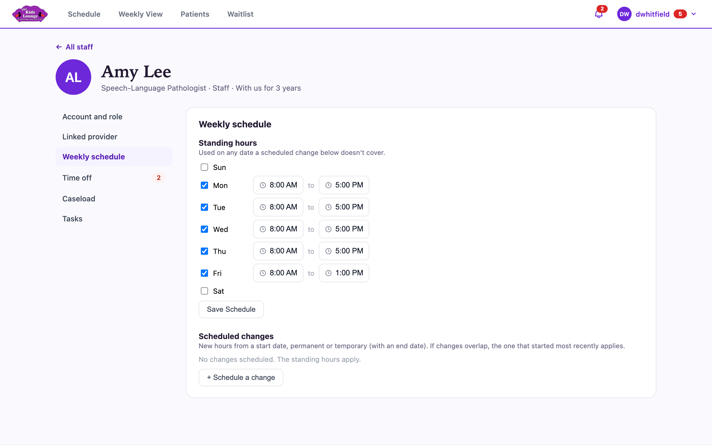

## The Admin area

**Admin** in the menu under your name holds staff accounts, time off approvals and office hours. Only Admin and Developer accounts can open it. The red number beside your name counts time off requests waiting for approval.

### Roles

| Role | What they can do |
|---|---|
| **Staff** | Their own schedule, time off, tasks and profile. They can book and edit appointments and see every patient. |
| **Reception** | Everything an admin can, except the Admin area. They can see any provider's week, use the task board and the data table, and delete others' comments. |
| **Admin** | Everything, including the Admin area. |
| **Developer** | Full access, plus the support ticket inbox. Never assigned automated patient tasks, and can't be a case manager. |

## Staff accounts

The **Staff** tab lists everyone with an account. Tick **Show archived** to include people who have left.

### Adding a staff member

1. Click **+ Add staff**.
2. Fill in their name, position, hire date and **role**. Their username is made from their initials, and it can't be changed later.
3. If they see patients, choose **Yes, add them as a provider** and pick their specialties. They'll get their own column on the schedule.
4. Note the **temporary password**. Click **New one** for a different one.
5. Click **Create account**, then give them their username and temporary password. They choose their own password the first time they sign in.

### A staff member's profile

Click anyone to open their profile.

- **Account and role:**
  - **Edit** changes their name, position, hire date or role. You can change your own role, but at least one Admin or Developer must always remain.
  - **Reset password** gives them a new temporary password.
  - **Archive account** stops them signing in without deleting their history. It can be restored at any time.
- **Linked provider:** their provider details, including specialty (ST, OT, PT, SI; tick more than one if needed) and credentials. The provider is always named after the person.
- **Weekly schedule:** their contracted hours for each day, and scheduled changes to those hours from a future date. Time outside these hours is greyed out on the schedule, and the hours set how much PTO they earn.
- **Time off:** their requests, balances and balance history. See [Time off approvals and balances](#time-off-approvals-and-balances).
- **Caseload:** their appointments for the next two weeks.
- **Tasks:** their open and completed tasks.

Any change you save to someone's account asks you to re-enter your own password.

