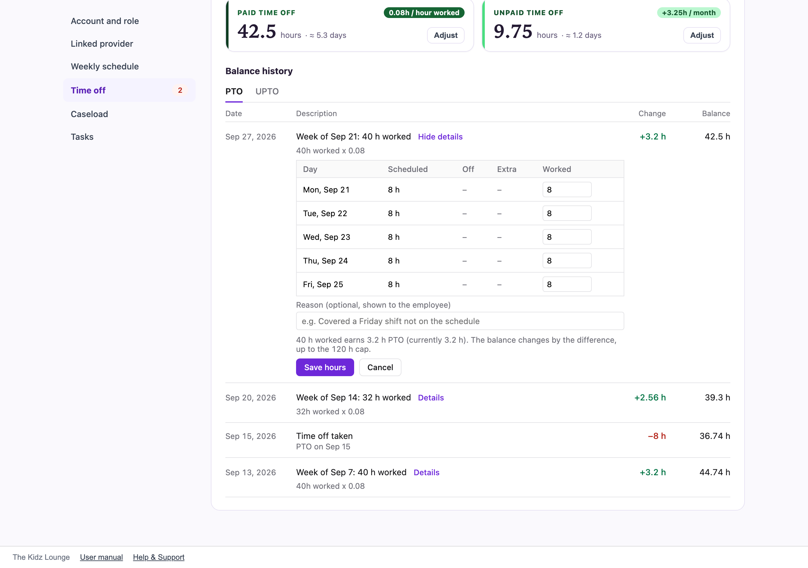

## Time off approvals and balances

The **Time off** tab in Admin covers everyone's requests and balances. The number beside it counts requests waiting for approval.

### Approving requests

The **Pending** tab lists requests waiting for a decision. PTO and UPTO requests show how many hours they'll use and what the balance will be afterwards.

- **Approve:** the time goes on the schedule, and PTO or UPTO hours come off the balance.
- **Deny:** you can add a reason. The employee sees it.
- **Edit:** change the dates or times first.
- **Delete:** remove a request entirely.

**Upcoming**, **Past** and **Denied** list the other requests. **Filter by name** shows one person. **Add time off** records time off for anyone, already approved.

> If approving would leave someone with a negative balance, you're warned first. You can still approve it.

### Everyone's balances

The **Balances** tab lists every employee's PTO and UPTO. Each row shows hours waiting for approval, weekly scheduled hours and the PTO earned each week. **At cap** means their PTO has reached 120 hours and has stopped growing.

To correct a balance, click the number, type the new total, add a reason if you like, and click **Save**. The change and the reason appear in that person's balance history.

One person's balances are also on their profile, under **Time off**, then **Balances**. Use **Adjust** there to set a balance directly.

### Correcting a week's hours worked

PTO is credited every Sunday from the hours each person worked that week. The hours are estimated from their schedule. If an estimate is wrong, for example because someone covered an extra shift:

1. Open their profile, go to **Time off**, then the **Balances** tab.
2. Under **Balance history**, click **Details** on that week, then **Edit hours**.
3. Change the **Worked** hours for any day, and add a reason if you like. The new PTO credit for the week is shown before you save.
4. Click **Save hours**.

The balance changes by the difference, still stopping at 120 hours. The week shows **Hours edited by** your name, and later recalculations leave it alone.

