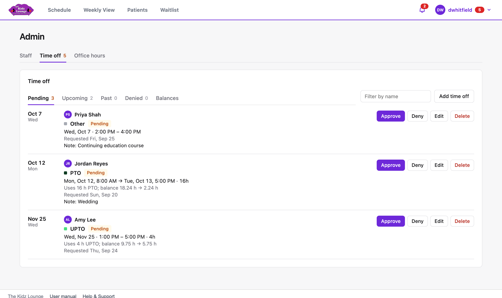
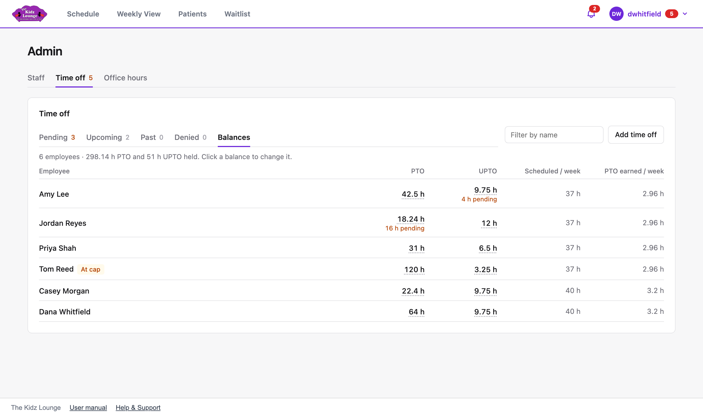
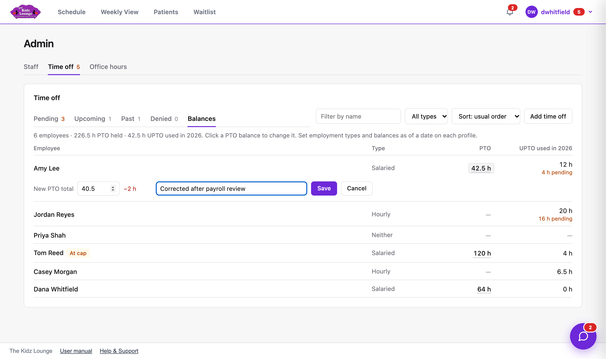
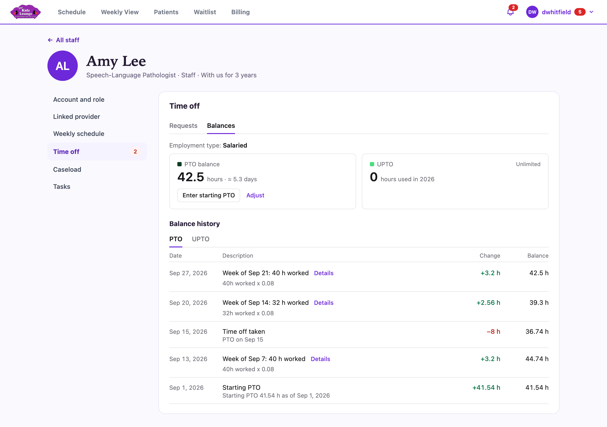

## Time off approvals and balances

The **Time off** tab in Admin covers everyone's requests and balances. The number beside it counts requests waiting for approval.

### Approving requests

The **Pending** tab lists requests waiting for a decision. PTO requests show how many hours they'll use and what the balance will be afterwards.

- **Approve:** the time goes on the schedule, and PTO hours come off the balance. UPTO is unlimited, so it's only counted.
- **Deny:** you can add a reason. The employee sees it.
- **Edit:** change the dates or times first.
- **Delete:** remove a request entirely.

**Upcoming**, **Past** and **Denied** list the other requests. **Filter by name** shows one person. **All types** shows one kind of request, and **Sort** orders them by date (newest or oldest first) or by type. **Add time off** records time off for anyone, already approved.

> If approving would leave someone with a negative PTO balance, you're warned first. You can still approve it.

> Only salaried staff can take PTO, and only salaried and hourly staff can take UPTO. If someone's request doesn't match their employment type, it can't be approved. Deny it, or change their employment type first.

### Everyone's balances

The **Balances** tab lists every employee's employment type, PTO balance (salaried staff only) and the UPTO hours they've used this year. Hours waiting for approval are shown under each. **At cap** means their PTO has reached 120 hours.

To correct a PTO balance, click the number, type the new total, add a reason if you like, and click **Save**. The change and the reason appear in that person's balance history.

One person's balances are also on their profile, under **Time off**, then **Balances**.

### Entering someone's starting PTO

1. Open their profile, go to **Time off**, then the **Balances** tab.
2. Click **Enter starting PTO**.
3. Choose the **As of** date and enter their **Starting PTO hours** on that date.
4. Click **Save**.

Approved PTO taken from that date on is subtracted automatically, and the result becomes their balance. **Adjust** sets the balance directly instead.

