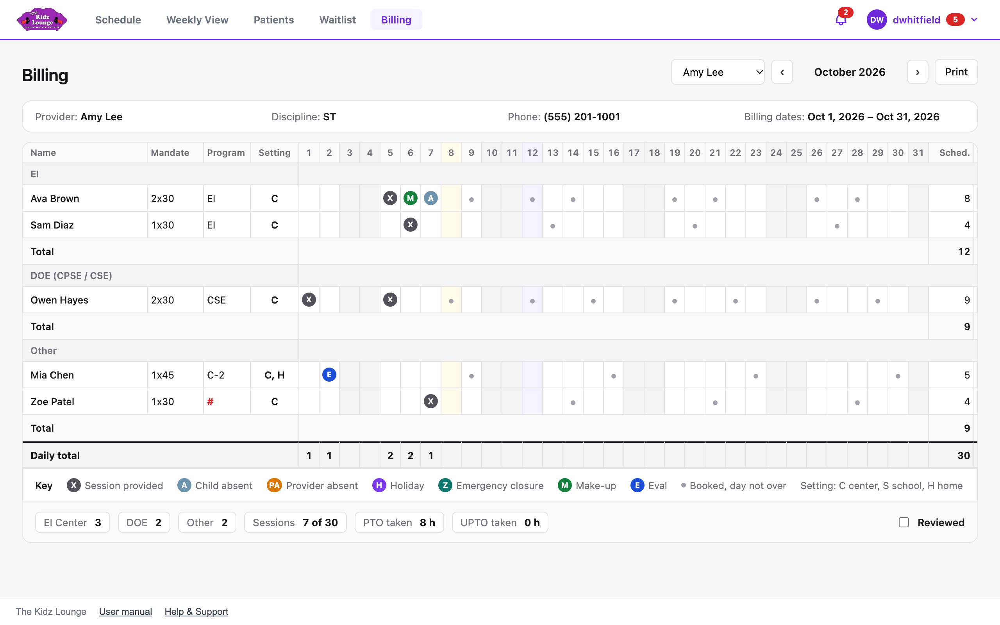

## Billing

**Billing** in the top bar shows one provider's month, laid out like the paper billing invoice.

<!-- only: staff -->
It opens on your own sheet. If no provider is linked to your account, ask an admin.
<!-- end -->
<!-- only: reception, admin -->
Pick the provider at the top.
<!-- end -->

- **‹** and **›** move a month back or forward, and **This month** comes back to the current month.
- **Print** prints the sheet on one landscape page.

### Reading the sheet

Each row is a patient on the provider's caseload that month: anyone with an appointment with them in the month (any status). For the current month, it also includes patients booked with them later, who show with no sessions yet. Rows are grouped into **EI**, **DOE (CPSE / CSE)** and **Other** (insurance, P, PP and no program).

- **Mandate** and **Program** are the ones in effect for that month. An insurance, P or PP program shows as its billing code (for example C-2). A red **#** means the code hasn't been set yet. Set it in the patient's programs and mandates.
- **Setting** lists where sessions took place: **C** center (a room, or offsite at a center), **S** school, **H** home.
- Each day shows a mark once the day is over. A grey dot means a session is booked but the day isn't over yet.

| Mark | Meaning |
|---|---|
| **X** | Session provided |
| **A** | Child absent (Canceled or No Show) |
| **PA** | Provider absent (any time off or block on their schedule during the session) |
| **H** | Holiday |
| **Z** | Emergency closure |
| **M** | Make-up session |
| **E** | Evaluation |

- **Sched.** counts the sessions booked that month, and **Sessions** counts those provided (X, M or E). A make-up counts as a session but not as booked, because the session it replaces was already booked.
- The bar at the bottom totals each group, shows sessions provided out of booked, and the provider's PTO and UPTO hours that month.

<!-- only: admin -->
### Marking a sheet reviewed

Tick **Reviewed** at the bottom right once you've checked a sheet. It records who reviewed it and when. Only Admins can tick it.
<!-- end -->
<!-- only: staff, reception -->
An admin ticks **Reviewed** once they've checked the sheet.
<!-- end -->
