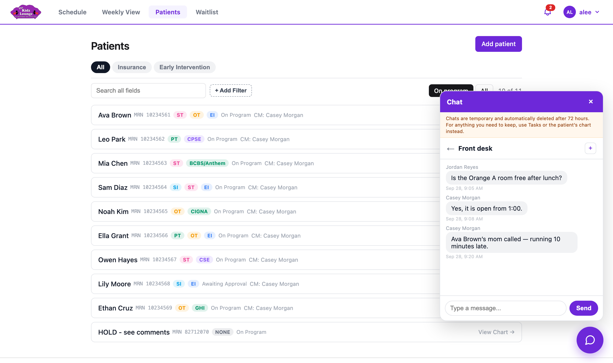

## Chat

The round purple button at the bottom right opens **Chat**, for quick messages with other staff.

- **New** starts a conversation. Pick one person, or several for a group, which you can name.
- Click a conversation to open it. Type your message and press **Enter** or click **Send**.
- **+** in a conversation adds someone.
- **×** beside a conversation removes it from your list only.

> Chats are deleted automatically after **72 hours**. For anything you need to keep, use a task or the patient's chart.
