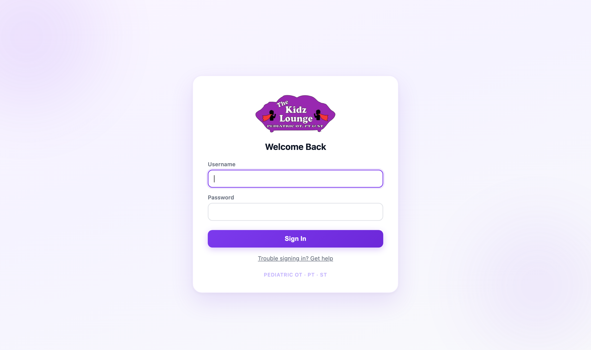
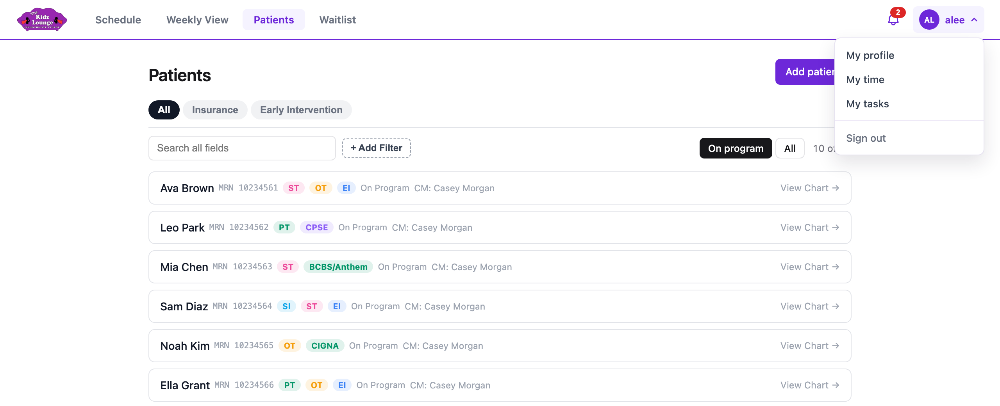

## Getting started

### Signing in

Go to the Kidz Lounge app and sign in with your username and password.

- **First time?** An admin gives you a username and a temporary password. After you sign in, you'll be asked to choose your own password.
- **Forgot your password?** Ask an admin to reset it. They'll give you a new temporary password.
- **Signing out:** you're signed out automatically after 30 minutes without activity, or when you close the browser tab. To sign out yourself, open the menu under your name and choose **Sign out**.

### Finding your way around

The bar across the top is on every page:

- **Schedule:** the day's appointments for the whole practice.
- **Weekly View:** a provider's week at a glance.
- **Patients:** every patient, and each patient's chart.
- **Waitlist:** patients waiting to start services.
- **Billing:** a provider's month as a billing sheet.
- **The bell:** your tasks. The red number is how many are open.
- **Your name:** opens the menu below.

The menu under your name has:

- **My profile:** your contact details and credentials.
- **My time:** your time off balances, your week, and your requests.
- **My tasks:** everything assigned to you.
<!-- only: admin -->
- **Admin:** staff accounts, time off approvals and office hours. Only admins see this.
<!-- end -->
- **Sign out.**

At the bottom of every page are **User manual** (this guide) and **Help & Support**, where you report a problem.

### Links in notes and comments

Web addresses typed into comments, notes, chat, tasks and meeting agendas become clickable links, and they open in a new tab.

To show a link as words instead of the address, click **Insert link** at the bottom right of a comment, notes, task or agenda box. Type the **Text to display** and the address, then insert it. In the box it reads as `[text](address)`, and once saved only the text shows. To change a link, put the cursor in it and click **Insert link** again.
