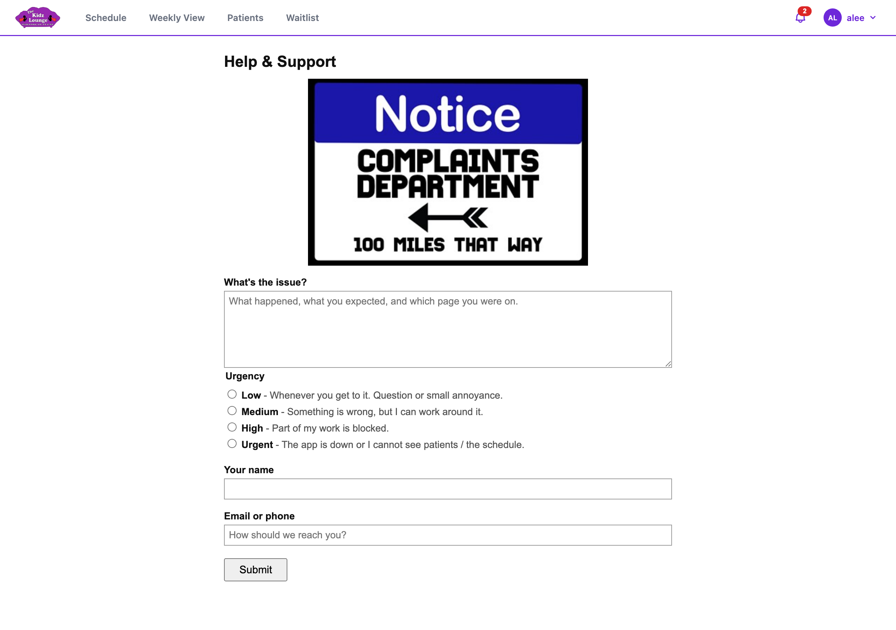

## Getting help

If something isn't working, or you have a question the manual doesn't answer, click **Help & Support** at the bottom of any page.

1. Enter your name and how to reach you.
2. Choose how urgent it is.
3. Describe what happened, and what you were trying to do. **Don't include patient names or details.** Describe the problem in general terms.
4. Send it. You'll get a reference like **KL-QMZRTA** to quote if you follow up.

If you were signed in when you sent it, a message pops up in the app when the issue is resolved. Help & Support also works when you can't sign in.
