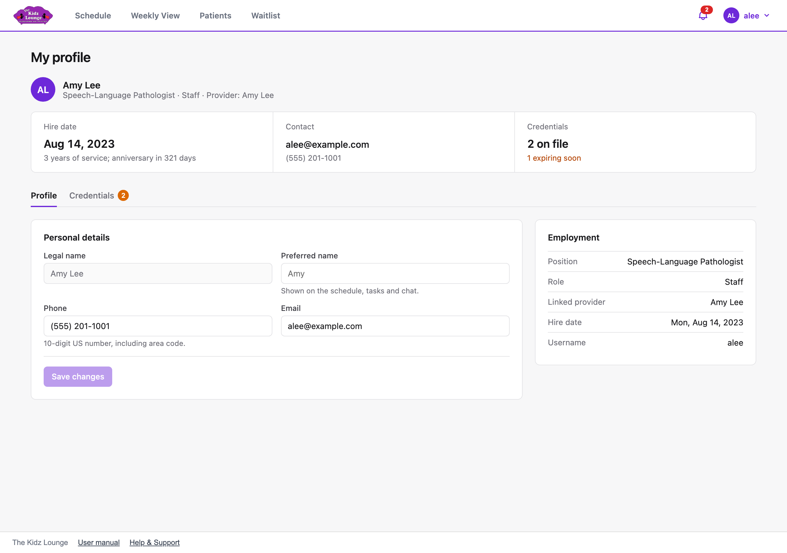

## My profile

**My profile** (in the menu under your name) holds your contact details, your employment details and your credentials.

- **Contact:** click **Edit** to change your phone number, email, or the name you go by. Phone numbers are 10-digit US numbers.
- **Employment:** your position, role, hire date and linked provider. An admin keeps these up to date.
- **Credentials:** your licenses and certifications, with their expiration dates.
  - **Add credential** records a new one.
  - When you renew one, edit it and enter the new expiration date.
  - Credentials expiring soon are flagged, and you'll get a task **30 days before** one expires.
