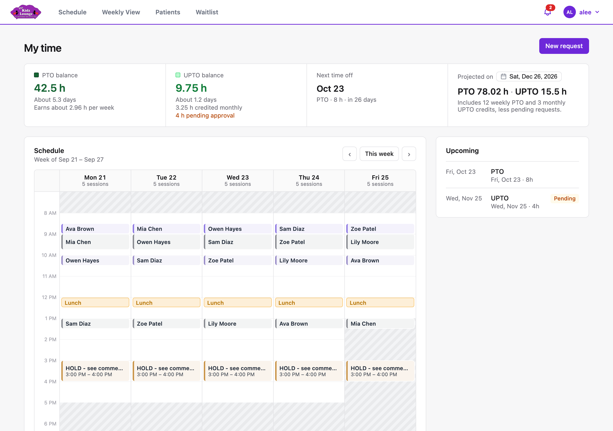
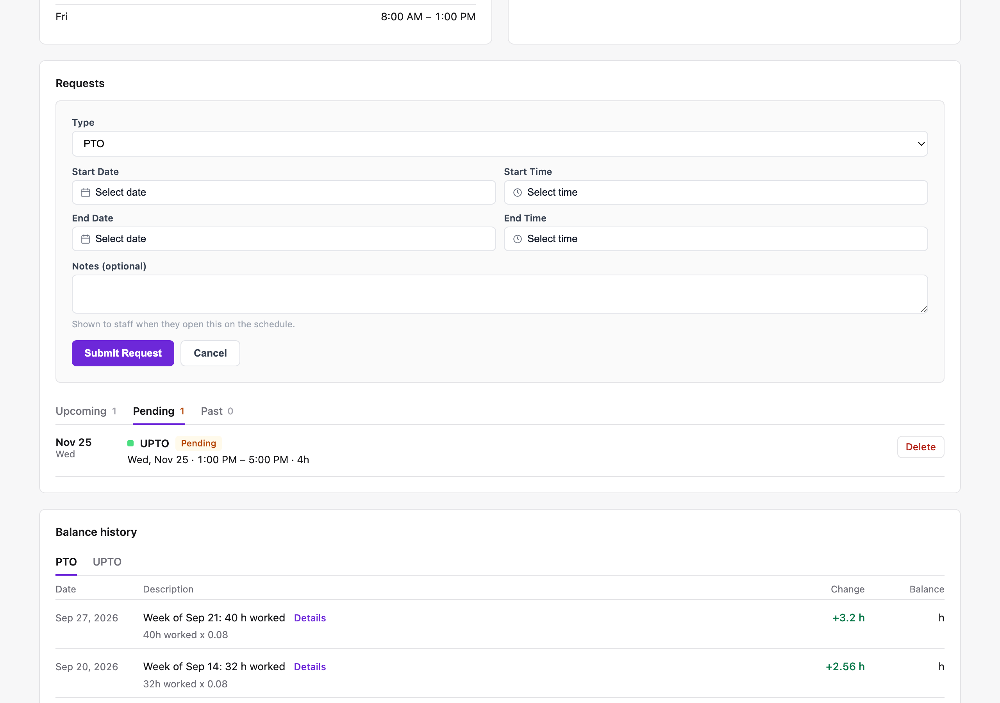
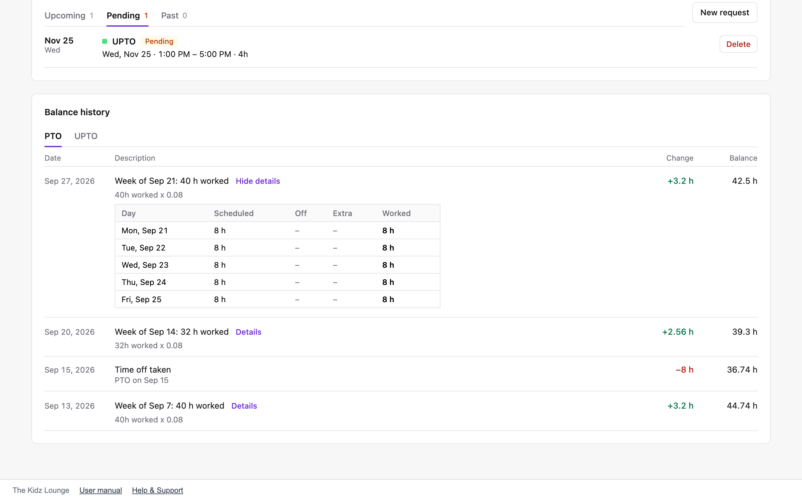

## My time

**My time** (in the menu under your name) shows your time off balances, your week, and your requests.

### Your balances

- **PTO balance:** paid time off. You earn **0.08 hours of PTO for every hour you work**, credited each Sunday for the week before.
  - The PTO balance stops growing at **120 hours**.
  - At the end of each year, anything over **40 hours** doesn't carry over.
  - Days when you don't see any patients don't count toward PTO.
- **UPTO balance:** unpaid time off, credited at **3.25 hours on the 1st of each month**.
- **Next time off:** your next approved time away.
- **Projected on:** pick a date to see what your balances will be by then, taking pending requests into account.

### Your week

The **Schedule** card shows your week: your sessions, lunch, meetings and time off. Greyed-out time is outside your contracted hours. Click any block to open it. **Upcoming** lists your next time off, and the card beside it shows your contracted hours.

### Requesting time off

1. Click **New request**.
2. Choose the **type**:
   - **PTO:** paid time off. It uses your PTO hours.
   - **UPTO:** unpaid time off. It uses your UPTO hours.
   - **Lunch** or **Meeting:** blocks time on your schedule. A meeting can include other staff, and has an agenda and comments.
   - **Unavailable** or **Other:** blocks time for anything else.
3. Choose the start and end date and time, and add a note if you like. The form shows how many hours the request will use.
4. Click **Submit Request**.

Your request shows as **Pending** until an admin approves or denies it. Approved time off appears on the schedule.

> PTO is charged for your **scheduled** hours only. A full week off uses the hours you'd normally work, not every hour of the week. PTO taken in a row can't be more than two weeks of your usual hours. Ask for any extra days as UPTO. A request can leave you with a negative balance, as long as an admin approves it.

### Changing or cancelling a request

Your requests are under **Upcoming**, **Pending** and **Past**. **Delete** cancels a request. Hours used by approved PTO or UPTO go back on your balance. To change an approved PTO or UPTO request, edit it: the original is cancelled, and the change goes in as a new request for approval.

### Balance history

**Balance history** lists every change to your PTO and UPTO balances: weekly credits, time off taken, monthly UPTO, and adjustments. Click **Details** on a weekly credit to see the hours worked each day that it was based on.

