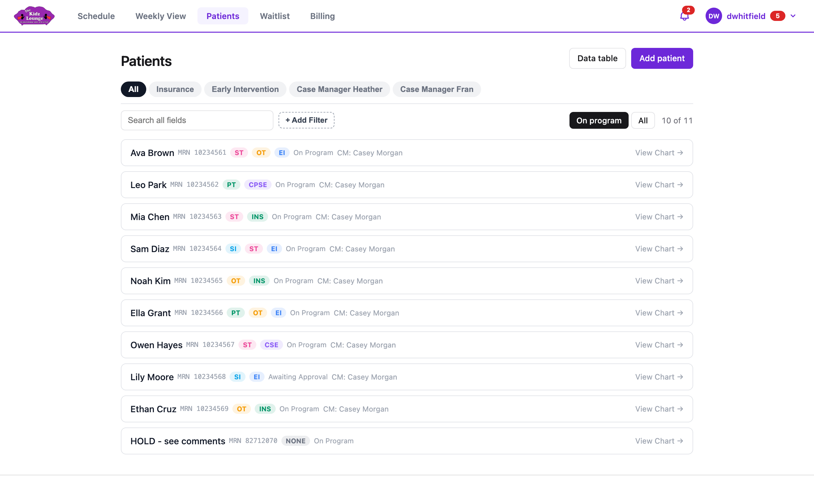
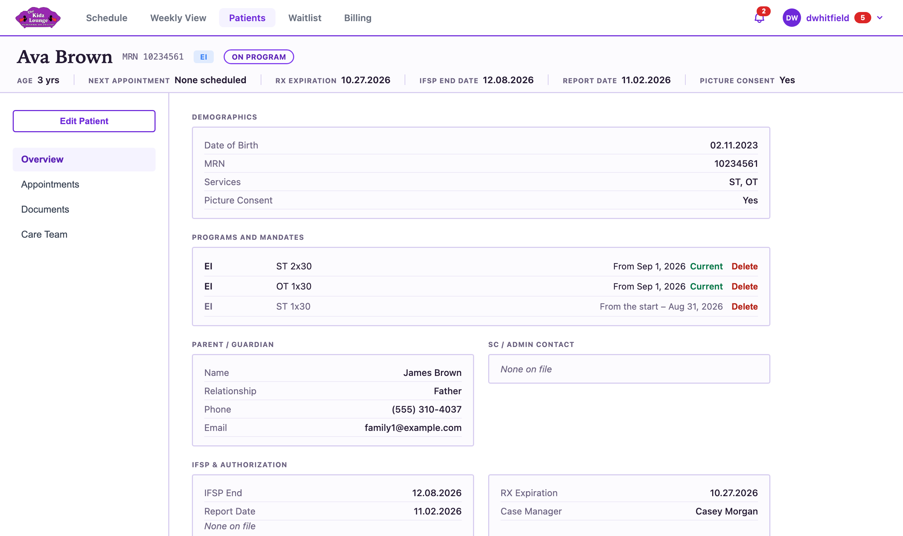
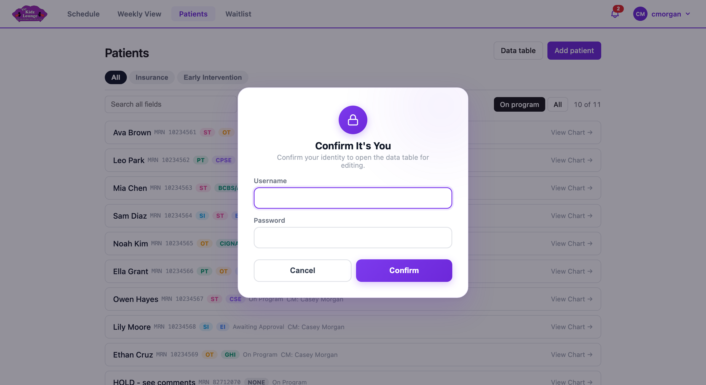

## Patients

**Patients** lists every patient. It starts with patients who are **On program**. Click **All** to include everyone, such as patients who are off program.

### Finding a patient

- **Search all fields:** type a name, MRN, parent's name or any other detail.
- **All / Insurance / Early Intervention:** show one group of patients.
- **+ Add Filter:** narrow the list by a specific field, for example Program is EI, or Case manager is Casey Morgan. Add as many filters as you need.
- **Clear filters** puts everything back.

The number at the right (for example "10 of 11") shows how many patients match.

Each patient's programs show as coloured bubbles. Insurers (such as BCBS/Anthem or CIGNA) all show as one **INS** bubble.

### A patient's chart

Click a patient to open their chart.

- **The banner at the top** shows the patient's name, MRN, program and status. It also shows their age, next appointment, and RX, IFSP and report dates, highlighted when a date is coming up soon.
- **Overview:** demographics, parent or guardian, service coordinator, IFSP, case manager, links, and the patient's **Programs and mandates** over time.
- **Appointments:** past and upcoming visits, with **Book Eval** for booking an evaluation.
- **Documents:** uploaded files and clinical notes.
- **Care Team:** the case manager and the **Current Providers**. A provider counts as current if the patient has any appointment with them this month or later, whatever its status.

### Links

A patient can have any number of links, for example to a shared folder or a form. Each has the text people see and the web address.

- On the chart, click **Edit links** (or **+ Add a link** if there are none yet). Fill in **Text to display** and the address for each one. Leave the text empty to show the address itself. Then click **Save links**, and re-enter your password.
- Links can also be edited in the patient form.

### Booking an evaluation

On the chart's **Appointments** tab, click **Book Eval**. The booking window opens as **Book Eval**. Pick the provider, date and time, then click **Create**. Evals are one-time bookings. They show a blue **Eval** tag on the schedule and on the chart, and an **E** on the billing sheet. An appointment can only be made an eval this way, and it can't be changed to or from an eval later.

### Adding or editing a patient

- **Add patient** (on the Patients page) opens a blank patient form.
- **Edit Patient** (on the chart) changes their details. To protect patient information, you're asked to re-enter your password before the changes save.

### Programs and mandates

In the patient form, click a program (EI, CPSE, an insurer, P, PP and so on) to set its mandate for each service:

1. Tick each service the program covers (ST, OT, PT, SI). A service can only be under one program at a time.
2. Enter the **sessions per week** (for example 2, or 1-2) and the **minutes**.
3. For an insurance, P or PP program, choose its **billing code** (C-1 to C-6, or C-#). Until it's set, the billing sheet shows a red **#**.
4. Click **Save**.

When you change an existing patient's programs, choose when the change starts under **Program changes start on**. Appointments before that date keep the old program and mandate for billing. The first time a patient's old mandate is replaced, you can choose **Replace the old mandate for all dates** instead.

The chart lists every program and mandate, with the dates it applied, under **Programs and mandates**.
<!-- only: admin -->
Admins can **Delete** an entry there to fix a mistake. Deleting the current one brings back the one it replaced.
<!-- end -->

<!-- only: reception, admin -->
### The data table

**Data table** (at the top of the Patients page) shows every patient in one editable spreadsheet, for quick bulk updates. You're asked for your username and password before it opens.

Click a **Program** or **Mandate** cell to open the same programs and mandates editor as the patient form. Click a **Links** cell to edit that patient's links.

<!-- end -->
