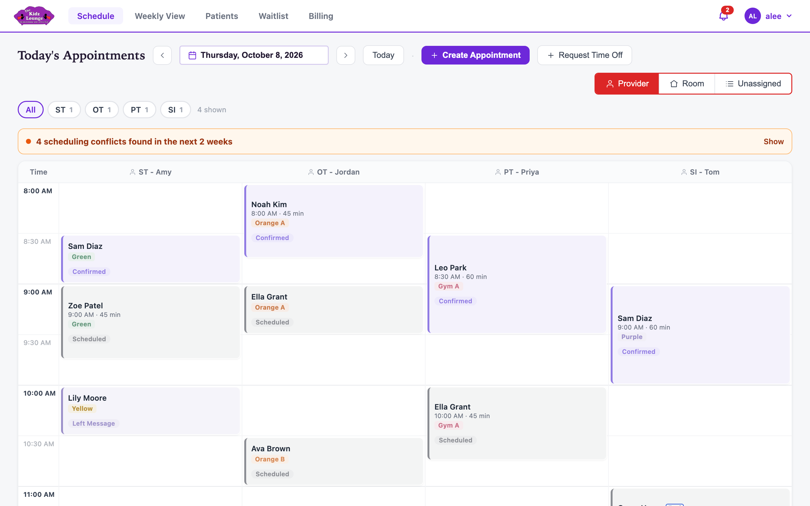
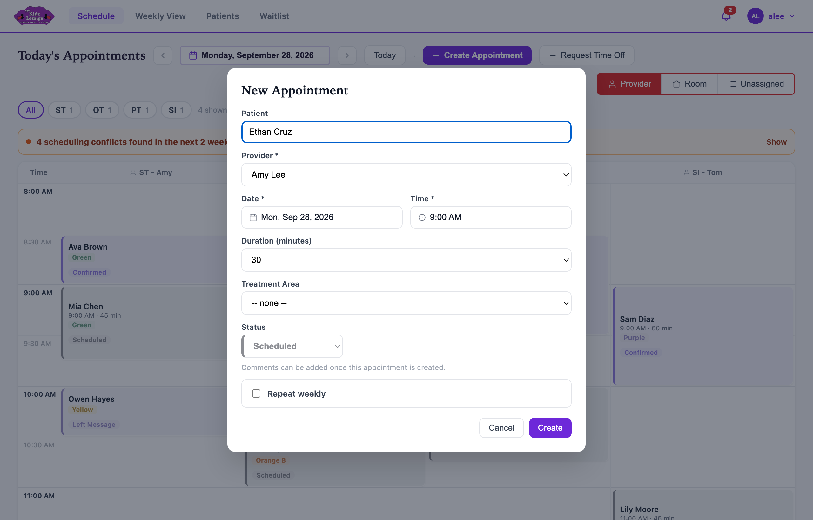
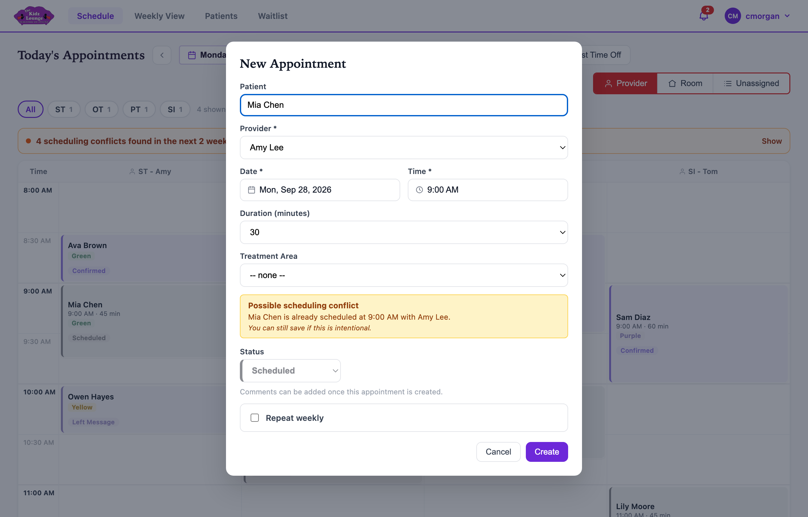
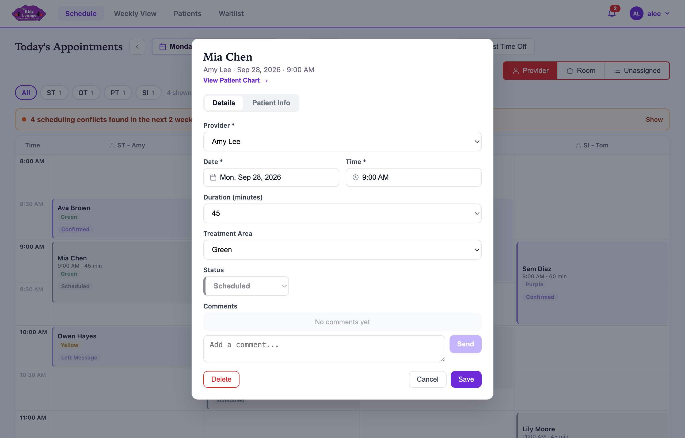
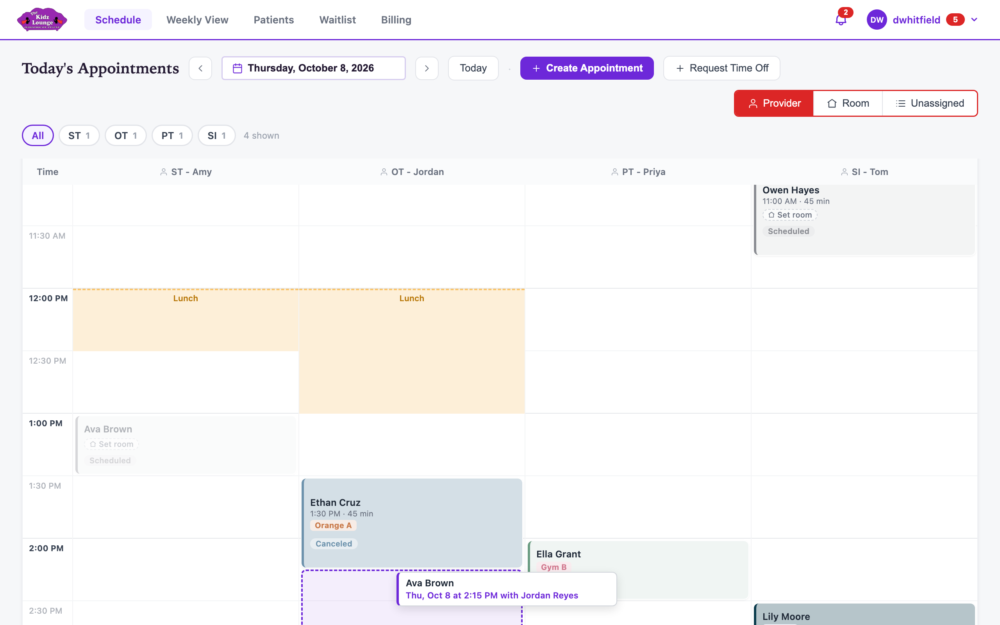
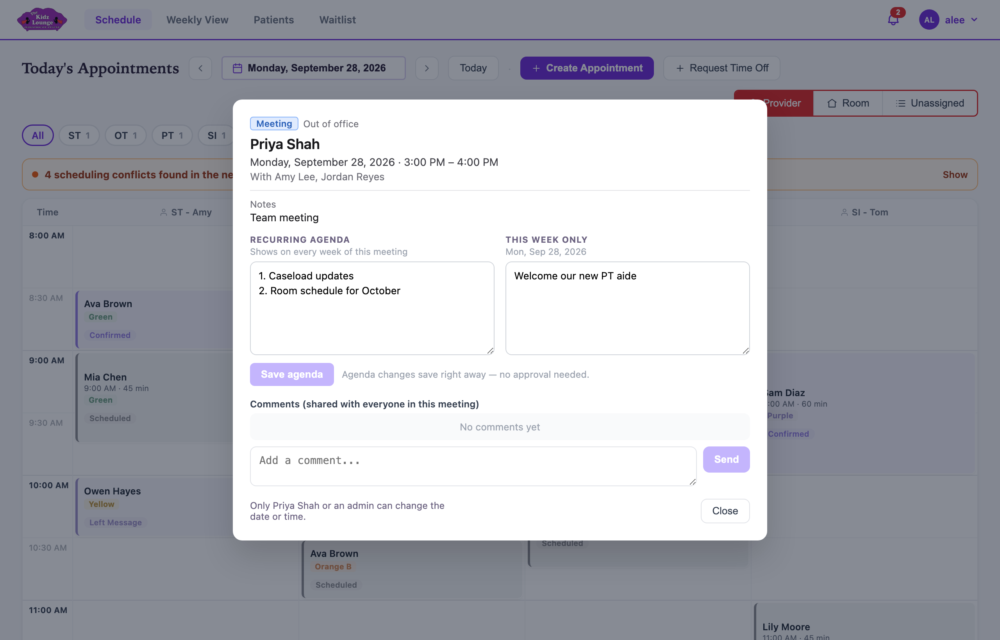
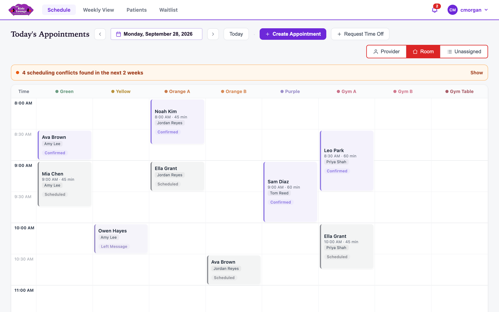
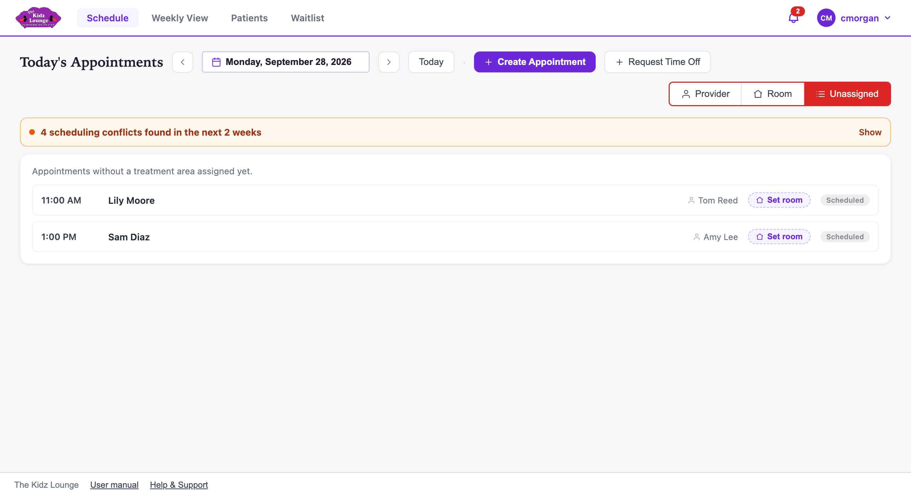

## The daily schedule

**Schedule** in the top bar opens the day's appointments for every provider. It opens on today, and it updates by itself every 30 seconds.

### Moving between days

- Use the **‹** and **›** arrows beside the date to go back or forward a day.
- Click the date to pick any day from a calendar.
- **Today** brings you back to today.

### Reading the schedule

- Each column is a provider, and each card is an appointment. A card shows the patient, the time and length, the room, and the status.
- The **ST / OT / PT / SI** buttons show only providers of that specialty. Pick more than one to combine them, or **All** for everyone. The app remembers your choice.
- Coloured blocks are time a provider isn't seeing patients: lunch, meetings, PTO and other time off. Click one to see its details.
- A blue line marks the current time.
- A small alert icon on a card means the patient has an allergy or immunization note on their chart.

### Booking an appointment

1. Click **Create Appointment**.
2. Start typing the patient's name, then pick them from the list.
3. Choose the **provider**, **date**, **time**, **length** and **treatment area** (room).
4. Leave the status as **Scheduled**, or pick another.
5. To book the same slot every week, tick **Repeat weekly**. Then choose how many weeks, or no end date.
6. Click **Create**.

> Times run from 8:00 AM to 6:00 PM in 15-minute steps. For a session away from the clinic, choose **Offsite** as the treatment area and type where.

If the patient or room is already booked at that time, a yellow **Possible scheduling conflict** box appears. You can still save if it's intentional.

If the patient is on the waitlist for that provider's specialty, you'll be asked whether to take them off the waitlist once the appointment is created.

### Changing or cancelling an appointment

Click any appointment card to open it. You can then:

- change the provider, date, time, length, room or status, then click **Save**
- add a **comment**, which everyone who opens the appointment can see
- open the patient's chart with **View Patient Chart**
- **Delete** a mistaken booking. For a no-show or a cancellation, change the status instead, so the history is kept.

For a repeating appointment, you're asked whether a change applies to **this one only** or to **this and all future** appointments.

### Moving an appointment by dragging

Drag a card to a new time, or onto another provider's column, to move it there. On a phone or tablet, press and hold the card until it lifts, then drag it.

- A dashed outline shows where it will land, in 15-minute steps.
- To move it to another day, hold the card over the **‹** or **›** arrow at the top until the day changes, then drop it.
- In the **Room** view, dropping a card in another room's column changes its room.
- It's saved as soon as you let go. Click **Undo** in the bar at the bottom of the window to put it back.
- For a repeating appointment, only that day's appointment moves. The rest of the series stays as it is.
- Moving onto time off or another booking is allowed. The usual conflict warnings then appear, so you can fix them.

Dragging a **Canceled** or **No Show** appointment doesn't move it. It books a make-up session where you drop it, and the outline turns green. The canceled appointment stays where it was. A canceled appointment that already has a make-up can't be dragged.

### Appointment statuses

| Status | Use it when |
|---|---|
| Scheduled | The appointment is booked. |
| Confirmed | The family has confirmed. |
| Left Message / Emailed | You've reached out but haven't heard back. |
| Canceled | The appointment won't happen. It stays on the record but is greyed out. |
| No Show | The patient didn't come. |
| Make Up / MUS | A make-up session. |
| \*HOLD\* | Time held on a provider's schedule. |

**HOLD - see comments** is a placeholder patient used to hold time on a provider's schedule. Put the reason in the comments. A hold can be booked with several providers at once without counting as a conflict.

### Meetings and time off on the schedule

Click a coloured block to see who it's for, when, and any notes. Meetings also show who's invited, the agenda, and comments shared with everyone in the meeting.

To ask for time off, use **Request Time Off** on the schedule or go to **My time**. See [My time](#my-time).

<!-- only: reception, admin -->
### Rooms and unassigned appointments

The buttons at the top right switch the schedule's layout:

- **Provider:** a column for each provider (the usual view).
- **Room:** a column for each treatment area, to see which rooms are free.
- **Unassigned:** appointments that don't have a room yet. Click **Set room** to give one a room without opening it.

### Scheduling conflicts

The orange bar under the specialty buttons counts problems in the next two weeks. Click **Show** to list them:

- a provider, room or patient double-booked
- an appointment during a provider's time off or outside their hours
- an appointment on a day the office is closed

Click a conflict to open the appointments involved and fix one. If a conflict is intentional, click **Dismiss** to hide it. The restore button brings dismissed conflicts back.
<!-- end -->
