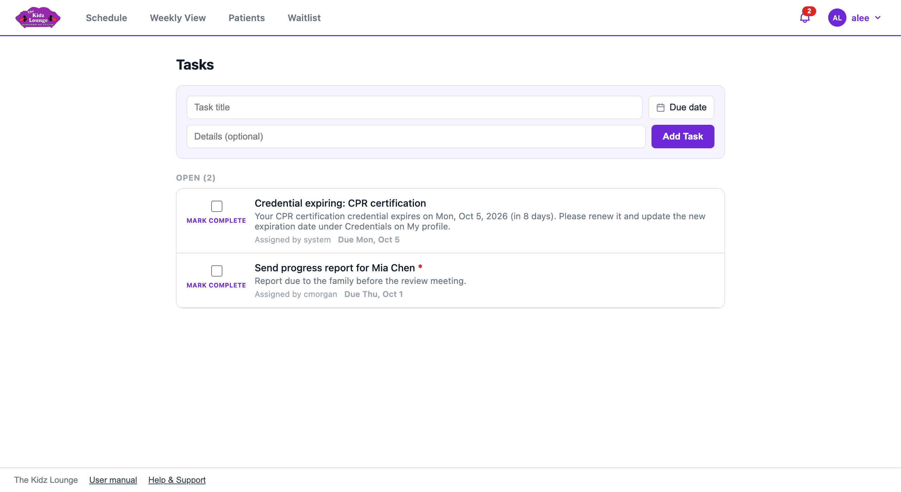
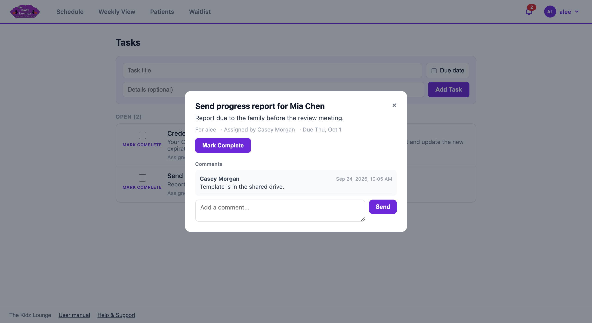
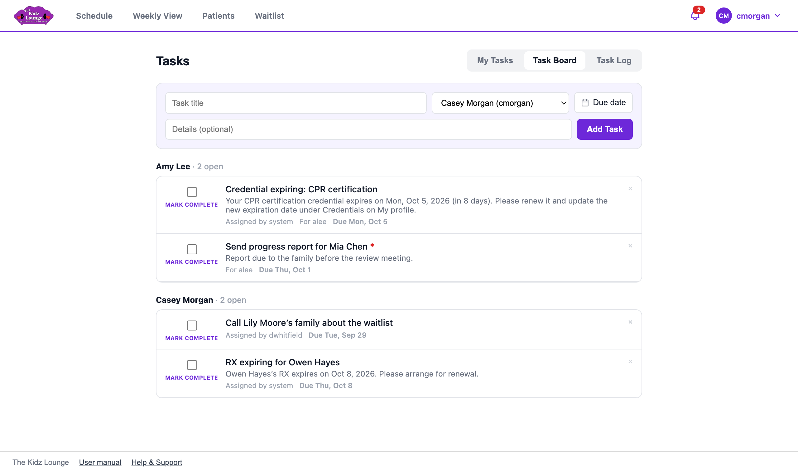

## Tasks

The **bell** in the top bar opens your task list, and the red number shows how many are open. **My tasks** in the menu under your name opens the full page.

- **Adding a task for yourself:** type a title, optional details and a due date, then click **Add Task**.
- **Opening a task:** click it to see the full details and comments. Add a comment to ask a question or give an update.
- **Finishing a task:** tick **Mark complete**.

### Tasks the app creates for you

Some tasks are created automatically, marked **Assigned by system**:

- **Credential expiring:** one of your credentials expires within 14 days.
- **Report due:** a progress report is due for a patient you're currently seeing.
- **RX expiring / IFSP ending:** sent to the patient's case manager.
<!-- only: staff -->
  If a patient has no case manager, these go to reception and admins.
<!-- end -->
<!-- only: reception, admin -->
  If a patient has no case manager, these go to all Reception and Admin staff.
<!-- end -->

<!-- only: admin -->
- **Staff credential expiring:** a staff member's credential expires within 14 days. Every admin gets one of these.
<!-- end -->

<!-- only: reception, admin -->
### The task board and task log

The **Task Board** tab lists everyone's open tasks, grouped by person. Use it to assign a task to anyone: pick their name before you click **Add Task**. The **Task Log** tab shows completed tasks.

<!-- end -->
