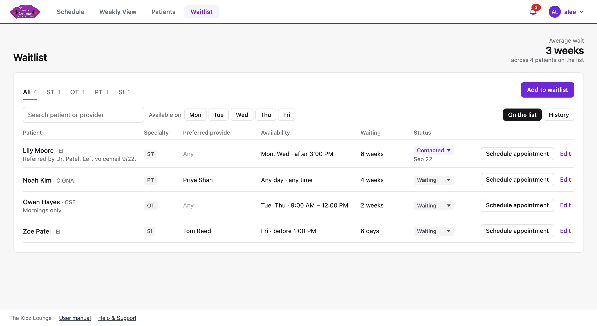
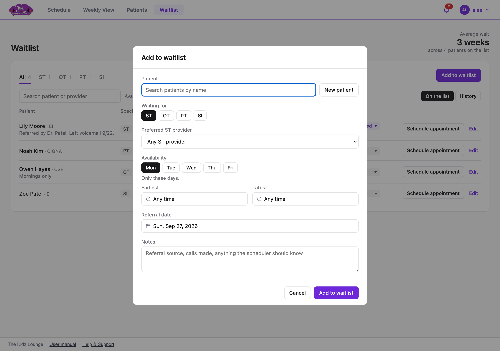

## The waitlist

**Waitlist** lists patients waiting to start a service. The longest wait is at the top. The **average wait** across everyone on the list is at the top right.

A child waiting for more than one service has one entry per specialty. For example, a child waiting for ST and OT has two entries, so each can be scheduled on its own.

### Finding someone

- The **All / ST / OT / PT / SI** tabs show one specialty.
- **Search** finds a patient or a preferred provider.
- **Available on** shows families who can come on that day.
- **On the list / History** switches between current entries and ones that were scheduled or removed.

### Adding a patient to the waitlist

1. Click **Add to waitlist**.
2. Search for the patient. If they're new, click **New patient** to add them first.
3. Choose the specialties they're waiting for, and a preferred provider for each if the family has one.
4. Pick the days they can come, and an earliest and latest time if they have limits.
5. Set the **referral date**. The wait is counted from this date.
6. Add any notes, such as the referral source or calls made, then click **Add to waitlist**.

### Keeping entries up to date

- Click an entry's **status** to change it:
  - **Waiting:** still waiting.
  - **Contacted:** you've reached out to the family. The date is recorded.
  - **Scheduled** or **Removed:** takes the entry off the list and into History.
- **Edit** changes any detail of the entry.

### Scheduling someone off the waitlist

Click **Schedule appointment** on their entry. The appointment form opens with the patient and their preferred provider already filled in. When you click **Create**, the entry is marked **Scheduled**, and the patient's status is set to **On Program**.

If you book a waitlisted patient from the schedule instead, you'll be asked whether to take them off the waitlist.

In **History**, **Return to waitlist** puts an entry back on the list, and **Delete** removes a mistaken entry for good.
