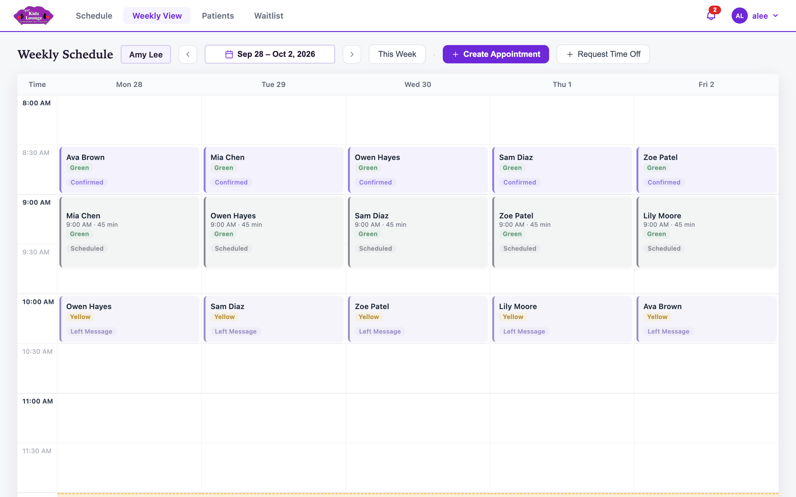
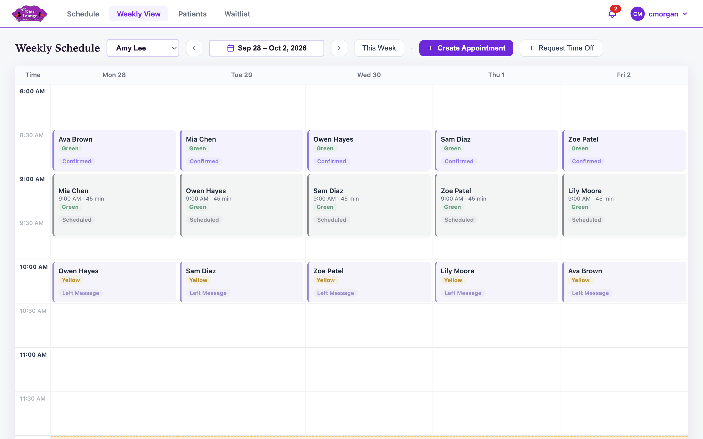

## The weekly view

**Weekly View** shows one provider's Monday to Friday. The week runs Sunday to Saturday, so on a Sunday it already shows the week ahead. The office is closed on weekends, so Saturday and Sunday aren't shown.

<!-- only: staff -->
It opens on your own schedule.
<!-- end -->
<!-- only: reception, admin -->
Click the provider's name at the top left to switch to another provider.

<!-- end -->

- **‹** and **›** move a week back or forward, and **This Week** comes back to the current week. Click the dates to jump to any week.
- Click an appointment to open it, exactly as on the daily schedule.
- Drag an appointment to another day or time to move it, as on the daily schedule. Hold it over **‹** or **›** to carry it to another week.
- **Create Appointment** and **Request Time Off** work the same way as on the daily schedule.
- Greyed-out time is outside the provider's contracted hours.
- On a phone or tablet, the weekly view shows one day at a time, and the arrows skip weekends. The buttons are shortened to **+ Appointment** and **+ Time off**. (The daily **Schedule** page needs a larger screen, so use the weekly view on a phone.)
